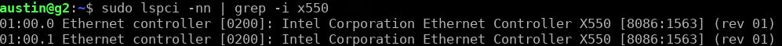
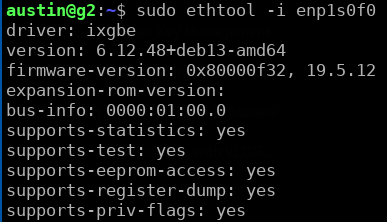
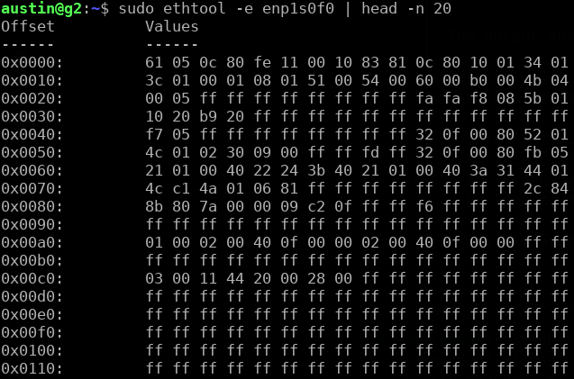
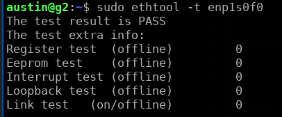
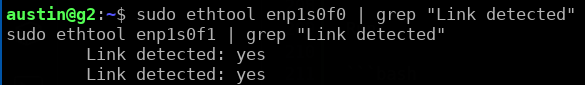
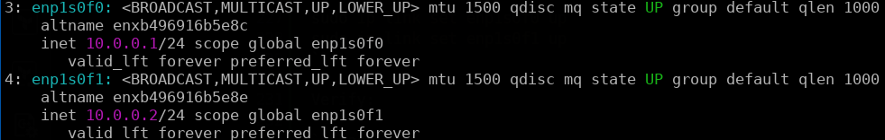
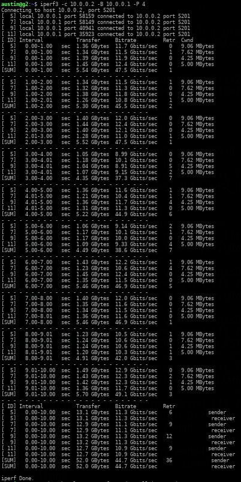

# Validating an Intel X550 NIC (Dell Part # C4D5P)

## Overview

I have in the past had issues when purchasing Network Interface Cards (I will, going forward, refer to a Network Interface Card as a NIC). At times I have received goods that were of dubious origin, some of these have performed well enough, and some have not.

If you intend to use a NIC on a system that requires uptime, it's a good idea to briefly investigate it and at least ensure that it's a genuine part that passes some basic tests.

## Initial Inspection

Determining a counterfeit PCB by visual inspection can be very easy, or almost impossible, a thorough treatise on that topic is beyond the pervue of this repo, but briefly:

1. **Look for Intel markings & stickers**

   * On the **green PCB** itself, you should see a **printed white Intel logo** as part of the board silkscreen, not just on a sticker.
   * Look for a **hologram/Yottamark/BradyID style sticker** near the bracket or on the heatsink/PCB. Genuine retail/OEM cards often have one; missing or obviously fake holograms can be a red flag. (my card, an OEM Dell model, did not come with a holograpic sticker, investigating the matter, I found that the OEM cards often do not, an actual Intel card definitely would)
   * Check for a **printed part number** like `X550-T2`, `X550T2BLK`, or an OEM FRU (Dell/Lenovo/HP part codes) on the main label.

2. **Check build quality**
   
   * This is, in my limited experience, the most obvious sign of trouble, prior to installing the card. 
   * Solder joints should look clean and uniform; no obviously hand-soldered wires, bodge wires, or random stickers covering chips.
   * The heatsink should be firmly mounted with proper screws, not glued or wobbly.
   * The RJ45 ports should be firmly aligned with the bracket and not crooked.

3. Optional but helpful: **take a clear photo** of the front of the card (label & heatsink side). If anything looks off, you can describe it or compare to product photos from Intel/major resellers later.

### Sources

[How to distinguish 10-Gigabit network card Intel X520-DA2](https://hwp24.com/articles/how_to_distinguish_10_gigabit_network_card_intel_x520_da2_from_chinese_fakes/)

---

## Hardware Installation

For this I will be placing the NIC in an HP EliteDesk 800 G2 SFF PC.

The process is very straightforward:
- Remove the side of the case.
- Remove the PCIe slot retention arm.
- Remove the PCIe slot place holder.
- Insert the card.
- Return the retention arm to it's original position.
- Close the case.
TODO: Add photo

## Hardware Identification

1. One of the first things to be done would be a basic hardware inspection using `lspci` or when thoroughness matters I prefer `lshw`.

```bash
sudo apt install lshw -y
sudo lshw
```

Not too far from the top you should find output like the following:


2. Confirming PCI IDs can be done next.

```bash
sudo lspci -nn | grep -i x550
```

The output should be something like the following:



**Important values:**

* Vendor ID should be **8086** (Intel)
* Device ID should be **1563**
* Subsystem Vendor should be **8086** or the OEM that made the card (Dell, HP, Lenovo, Supermicro)

**Read the NIC’s EEPROM + branding using ethtool**

This step helps confirm the card isn’t a counterfeit by checking whether the EEPROM contains expected Intel fields.

Run:

```bash
sudo ethtool -i enp1s0f0
```

You should see something like:



Then run the EEPROM dump header check:

```bash
sudo ethtool -e enp1s0f0 | head -n 20
```

The output should look something like:



I'm looking for:

* Intel’s typical EEPROM structure
* No weird `ff ff ff ff` blocks in the first lines
* No strange vendor strings
* No mangled MAC prefix

**The MAC prefix is `B4:96:91`**, which belongs to Intel — that’s a very good sign.

## EEPROM Integrity Check
Based on the at EEPROM a few things can be checked:

1. First bytes `61 05 0c 80`

These are the correct Intel X550 EEPROM header pattern.
Counterfeit cards usually begin with garbage, all `ff`s, or an I210-style header.

2. Valid config blocks and checksums

Real Intel cards have structured config words, not solid `ff ff ff ff`.

3. Firmware field appears in the EEPROM (`32 0f 00 80`)

This corresponds exactly to:

* Firmware version: **19.5.12**
* Firmware image ID: **0x80000f32**

Matching the `ethtool -i` output.

4. The MAC address region is not corrupt

MAC prefix `B4:96:91` = **an Intel-assigned OUI**.

5. No unusual vendor strings, no missing EEPROM blocks

Counterfeit boards commonly have blank sections around 0x0000–0x0070 or weird ASCII text.

Everything checks out.


## Firmware & Driver Verification
### Check if the firmware is the latest version

Run:

```bash
sudo ethtool -i enp1s0f0 | grep firmware
```

`ethtool -i` already output:

```
firmware-version: 0x80000f32, 19.5.12
```

Run:

```bash
sudo /sbin/modinfo ixgbe | grep version
```
(just `modinfo` wasn't part of my user's PATH)

The output should be:


Firmware 19.5.12 is the latest firmware released (in 2020) by [Intel](https://www.dell.com/support/home/en-us/drivers/driversdetails?driverid=40ntk)


## Link & Diagnostic Testing

Run Intel’s on-card diagnostics

Now to test the NIC itself.

**First, connect the port of `enp1s0f0` to a switch.**
(without doing so the test will show `fail` despite being `0` for everything but the link test)
**Run the built-in Intel test suite:**

```bash
sudo ethtool -t enp1s0f0
```

Expected output includes checks like:



If the port is not connected to anything it may say fail, but as long as it's shows all `0` for the rows preceding `Link test`, it's fine.

## Loopback & Throughput Testing (iperf3)

This part can be performed using a connection to another host, but optimally it needs to be connected to another host that also supports 10gbps

So, for this I'll just plug one port into the other and test the 2 10gbps ports using each other.

Physically plug a CAT6a/CAT7 cable:

```
Port 0 (enp1s0f0)  <——>  Port 1 (enp1s0f1)
```

Wait ~3 seconds, then check:

```bash
sudo ethtool enp1s0f0 | grep "Link detected"
sudo ethtool enp1s0f1 | grep "Link detected"
```



Both should be **yes**.

Run:

```bash
sudo apt install iperf3
```

**Bring up temporary IPs on each port**

Assign simple link-local addresses:

```bash
sudo ip addr add 10.0.0.1/24 dev enp1s0f0
sudo ip addr add 10.0.0.2/24 dev enp1s0f1

sudo ip link set enp1s0f0 up
sudo ip link set enp1s0f1 up
```

Verify:

```bash
ip -4 a
```



**Start iperf3 server on one port**

On **PORT 1 (enp1s0f1):**

```bash
iperf3 -s -B 10.0.0.2
```

Leave that running.

---

**Open another terminal, or split the window using tmux**
**Run iperf3 test from the other port**

On **PORT 0 (enp1s0f0):**

```bash
iperf3 -c 10.0.0.2 -B 10.0.0.1 -P 4
```

Using `-B` binds each side to a specific port so Linux doesn’t route it incorrectly.

Desired output:

* **9.2–9.7 Gbps** = excellent
* **8–9 Gbps** = acceptable
* **<5 Gbps** = cabling or negotiation issue



## Thermal Considerations

These NICs can get quite hot, and the only cooling present in the system is the CPU fan.

I will solve this by:
- getting a slimline sata -> regular sata adapter
- sata power -> 12v fan adapter
- adding a 40 or 60mm fan to help keep the NIC nice and cool